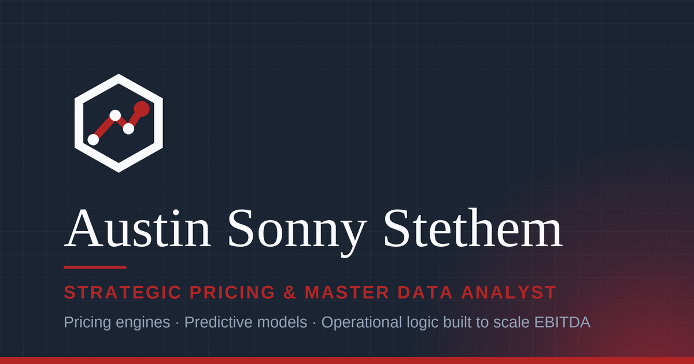

<p align="center">
  
</p>

<h1 align="center">Enterprise Pricing Architecture</h1>

<p align="center">
  <strong>One cost shock, followed end to end — from raw ERP extract to defended EBITDA.</strong>
</p>

<p align="center">
  <a href="https://austin-stethem.github.io">
    
  </a>
</p>

<p align="center">
  <sub>
    Python · Pandas · NumPy · Scikit-learn
    &nbsp;&nbsp;•&nbsp;&nbsp; Anonymized proxy data
    &nbsp;&nbsp;•&nbsp;&nbsp; No build step
  </sub>
</p>

---

## The Problem This Portfolio Is About

A price ladder with eight tiers should produce eight prices for a part. I pulled the rolling twelve-month history for one high-volume item and found **412 distinct prices**, from $94.28 to $192.20 — a 104% spread on an identical part, and a new distinct price roughly every twenty-one hours for a year.

Nobody decided that. Pricing structures fragment the way anything fragments without maintenance: a schedule built for the business as it was, a special arrangement for an important customer, discretion granted to the field to close a deal on a Friday, then twenty years of all three. Each step is defensible. Nobody signs off on four hundred prices.

What makes it expensive is the shape of the repair. A fragmented database can be normalised over a weekend. A fragmented price file cannot, because every anomalous price is attached to a person — a customer who has paid it for nine years, a manager who negotiated it, a rep whose relationship depends on it. **Prevention is a policy decision. Repair is a negotiation programme**, and its cost scales with headcount and tenure rather than data volume.

Sixteen case studies across three tracks, built around that.

---

## The Three Tracks

Each track is a five-step chain rather than a set of demos — every page picks up where the last one left off.

### Defense — holding margin when costs move

A 15% vendor cost spike hits the network. Five steps from mapping exposure to capturing the windfall.

| # | Case study | What it does |
| :--- | :--- | :--- |
| 1 | Predictive VIO Market Capture | K-Means branch tiering on revenue-decay profiles, with a derived confidence metric and a shape test that separates hub-stores from remote branches |
| 2 | Algorithmic Margin Defense | Deterministic cross-subsidization across an eight-tier ladder, protecting elastic items by loading inelastic ones |
| 3 | Stochastic Optimization | Monte Carlo price sweep with common random numbers for variance reduction, producing a risk cone rather than a point estimate |
| 4 | A/B Testing Framework | Two-proportion Z-test with power analysis, validating in market before anything reaches the ERP |
| 5 | FIFO Inventory Revaluation | Windfall cash-flow model measured against avoided cost rather than the price increase |

### Attack — where growth comes from, cheapest first

Ordered by what each costs to execute: a building, a lost customer, a conversation, and finally nothing at all.

| # | Case study | What it does |
| :--- | :--- | :--- |
| 1 | Market Capture Engine | 3,768 competitor rooftops across ten brand families. Serves four functions off one map: rep deployment, promotional targeting, regional price positioning, and merger closure forecasting |
| 2 | Greenfield VIO Expansion | Drive-time coverage subtracted from vehicle density, tested against the cost of the building it would take |
| 3 | Lost Account Win-Back | Churn labels derived from revenue trend rather than collected, ranked by recoverable profit under recency decay |
| 4 | Wallet Share & Affinity | Association rule mining filtered on lift rather than confidence, over a three-level per-account drill-down ranked by profit at every level |
| 5 | Contract Tier Clawbacks | Volume-tier entitlement auditing, with competitive exposure deciding which accounts are safe to reprice |

### Foundations — five ways a data system reports something confidently and wrong

| # | Case study | The failure |
| :--- | :--- | :--- |
| 1 | ERP Crisis Reconciliation | *The inventory is on the shelf.* It was under four feet of river. |
| 2 | Master Data Reconciliation | *These are two different customers.* Same entity, two spellings. |
| 3 | Logistics Spider-Mapping | *This is where the customer is.* That is a post office box. |
| 4 | Territory Balancer | *This account belongs to one rep.* Several are calling on it. |
| 5 | The Extract Layer | *This is what the item cost.* Cost is a convention, absent on a share of lines and silently treated as zero. |

---

## How It Was Built

> **The one measured outcome.** In the year a flood destroyed the primary warehouse, this network posted the only net-positive annual growth within its national alliance of independently owned distributors — a peer group that faced the same market and the same vendor pressure, but not the same river. Most of this portfolio carries no realised financial figure, because I do not sit in a function that sees realised profit and loss. Where a number would be invented rather than measured, there is none.

> **On authorship.** The interactive tools were built by directing an LLM rather than by hand-coding them. My contribution was the specification and the review loop: defining what each engine had to calculate, supplying the pricing and inventory logic it encodes, and iterating until the behaviour matched the strategy. Generating a Monte Carlo simulation is inexpensive now. Knowing what it ought to produce, and recognising when it does not, is not.

> **On the data.** Every figure in every dashboard is synthetic. Structures, ratios and failure modes are drawn from production systems; the numbers are proxies. Competitor brands, customer names and branch identifiers are fictional and consistent across pages, so an account appearing in one case study is the same account in the next.

---

## What Each Layer Does

| Layer | Role |
| :--- | :--- |
| **SQL** | Targeted extraction of pricing, inventory and transaction data, with the exclusion logic applied at the source rather than downstream: dead accounts, non-transacting line types, labour and service product groups, and internal store-to-store transfers are filtered before a single row reaches Python. Gross profit is derived at extract time from store-intake cost, which is what ties the margin figures to the price ladder rather than to list. |
| **Python** | Financial and spatial modelling well past data cleaning: Monte Carlo simulation, K-Means clustering with derived confidence scoring, association rule mining, haversine distance at scale, and the geocoding rescue pipeline behind the location census. |
| **Geospatial** | Rooftop-precision mapping of 3,768 competitor locations and 32,174 customer delivery points across eight states, with a proximity shield bounding a geocoding input that cannot be fixed at source. |

---

## Repository Contents

| File | What it is |
| :--- | :--- |
| `index.html` | Landing page and project index |
| `predictive-vio-market-capture.html` | Defense 1 — geospatial exposure, K-Means tiering |
| `algorithmic-margin-defense.html` | Defense 2 — cross-subsidization engine |
| `stochastic-margin-optimization.html` | Defense 3 — Monte Carlo risk cone |
| `ab-testing-framework.html` | Defense 4 — two-proportion Z-test |
| `fifo-inventory-revaluation.html` | Defense 5 — FIFO windfall model |
| `market-capture-engine.html` | Attack 1 — competitor census, merger modelling |
| `greenfield-vio-expansion.html` | Attack 2 — whitespace to capex payback |
| `win-back-engine.html` | Attack 3 — churn classification and recovery ranking |
| `wallet-share-affinity.html` | Attack 4 — association rules, support and lift |
| `contract-tier-clawbacks.html` | Attack 5 — entitlement audit |
| `erp-reconciliation-engine.html` | Foundations 1 — disaster recovery and phantom fulfilment |
| `legacy-silo-resolution.html` | Foundations 2 — entity resolution |
| `logistics-spider-mapping.html` | Foundations 3 — route overlap and bounded error |
| `territory-balancer.html` | Foundations 4 — workload distribution and coverage capacity |
| `extract-layer.html` | Foundations 5 — margin definition and exclusion governance |
| `portfolio.css` | Shared brand layer — tokens, typography, tooltips, navigation, print rules |
| `og-preview.png` | 1200×630 link-preview image referenced by the Open Graph tags |

---

## Running It Locally

No build step and no package manager. Open `index.html` directly, or serve the folder if you want relative paths and Open Graph tags to resolve exactly as they do in production:

```bash
python3 -m http.server 8000
# http://localhost:8000
```

Charting and mapping libraries load from cdnjs, so the dashboards need a network connection. If a library fails to load, each page degrades deliberately rather than breaking — the written analysis renders as normal and the interactive panel is replaced with a short notice.

---

## A Note on the Data

Every figure in these dashboards is generated from an anonymized proxy dataset. Branch coordinates, landed costs, POS revenue, and margin targets are randomized. The architecture, the elasticity logic, and the statistical methods are the production ones; the numbers are not real, and no client or employer data appears anywhere in this repository.

---

<p align="center">
  <strong>Austin Sonny Stethem</strong><br>
  Strategic Pricing &amp; Master Data Analyst<br>
  <a href="https://www.linkedin.com/in/austin-stethem-4503b4197/">LinkedIn</a> ·
  <a href="mailto:austinstethem1976@gmail.com">austinstethem1976@gmail.com</a>
</p>
